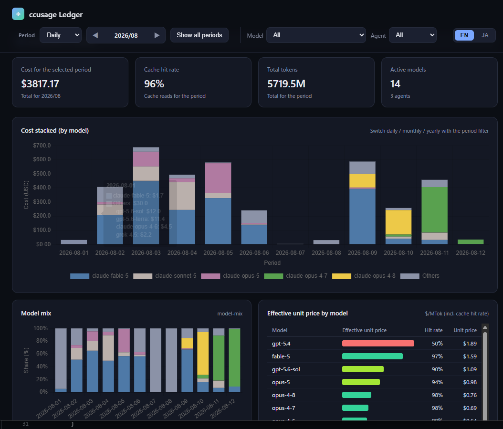

# ccusage Ledger

A personal dashboard that visualizes usage, token counts, and costs of agent CLIs (Claude Code / Codex / OpenCode, etc.).

It reads JSON emitted by [ccusage](https://github.com/ccusage/ccusage) and displays daily / monthly / yearly cost, tokens, and cache hit rate, plus per-model and per-agent breakdowns in charts and tables.

## Screenshot



## Requirements

[Bun](https://bun.sh) is required. The `ccusage-ledger` bin starts via `#!/usr/bin/env bun`, so it does not run on a machine without Bun (npm cannot enforce Bun, so install it beforehand).

## Getting Started

From the repository:

```sh
bun install
bun run dev
```

From the npm distribution:

```sh
bunx ccusage-ledger
```

The browser opens `http://127.0.0.1:3000` on start (local interactive environments only; it does not auto-open in a non-TTY environment).

## What it shows

- **Period granularity**: daily / monthly / yearly
- **Period navigation**: all periods, or select a specific month / year with ◀▶
- **By model**: cost stacking, mix ratio, effective unit price, cost ranking
- **By agent**: share donut (cost / token toggle), efficiency table
- **Detailed table by period × agent**
- **Language**: toggle Japanese / English in the top-right corner (initial language is English; the choice is saved in the browser and restored on the next launch)

## Configuration

| Env var | Default | Description |
|---|---|---|
| `HOST` | `127.0.0.1` | Bind address |
| `PORT` | `3000` | Bind port |
| `CCUSAGE_LEDGER_ALLOW_LAN` | (none) | Set to `1` to start with only a warning for a non-loopback bind |

### About LAN exposure

By default the server binds only to `127.0.0.1`. With a non-loopback bind such as `HOST=0.0.0.0`, anyone on the network can view the dashboard (usage data), and plaintext HTTP can be eavesdropped and tampered with.

- On a TTY, a warning is shown and confirmation is requested at startup
- On a non-TTY, startup is refused unless `CCUSAGE_LEDGER_ALLOW_LAN=1` is set
- On a non-loopback bind, `/api/usage` returns 403 (the data body is not served)

To view from another device, use an **SSH tunnel**. The tunnel itself acts as access control, and the connection source becomes loopback, so `/api/usage` works as well.

```sh
ssh -L 3000:127.0.0.1:3000 your-server
```

> Authentication is intentionally not implemented. This server assumes single-user local use; the boundary is enforced by limiting who can reach the screen (loopback / SSH tunnel).

## HTML Export

```sh
bun run export
```

Outputs a single HTML file to `dist/ccusage-ledger.html` in the current working directory.

**Caution**: The exported file contains your ccusage usage data. Only export it when sharing with someone you trust. For external distribution, set `X-Frame-Options: DENY` in the server response headers (the exported HTML's CSP is injected via `<meta>`, which browsers ignore for `frame-ancestors`; iframe embedding is only prevented by the JS frame buster).

## Data

The server runs [ccusage](https://github.com/ccusage/ccusage) (pinned as `ccusage@20.0.19`) directly to fetch the full history and caches it at `~/.cache/ccusage-ledger/usage.json` (based on `XDG_CACHE_HOME` if set). Secrets such as API keys are not passed to the child process.

## Development

```sh
bun run build      # bundle the frontend into dist/bundle.js
bun test           # run tests
bun run typecheck  # type-check
```

## License

MIT
